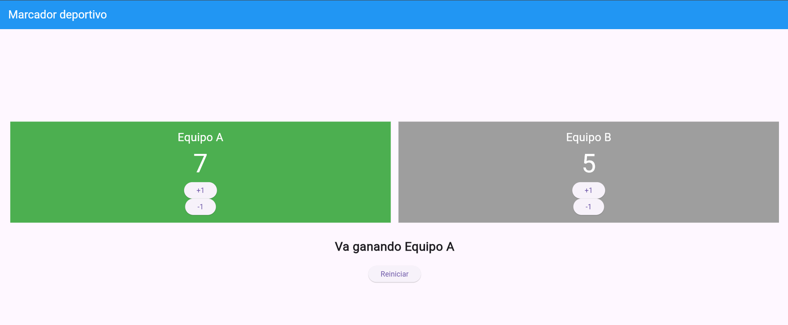
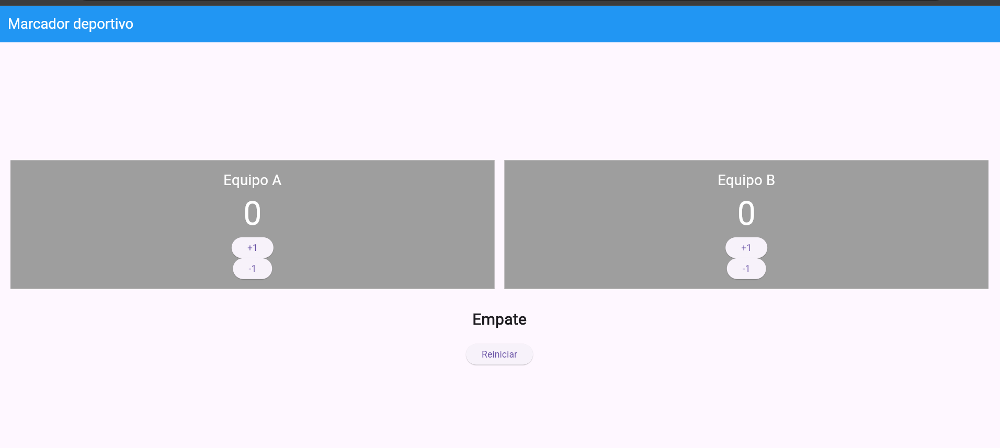

# Laboratorio: Marcador deportivo

Aplicación desarrollada con Flutter y Dart para controlar la puntuación de dos equipos.

## Funciones

- Muestra la puntuación de dos equipos.
- Permite sumar y restar puntos.
- Impide que la puntuación sea menor que cero.
- Indica qué equipo está ganando.
- Destaca en verde al equipo ganador.
- Muestra ambos equipos en gris cuando existe un empate.
- Permite reiniciar el marcador.

## Capturas

### Equipo ganando

### Equipos empatados

## ¿Qué hace setState?

`setState` le informa a Flutter que los datos internos del widget cambiaron. Al presionar un botón, modifica la puntuación y provoca que la interfaz se vuelva a construir para mostrar el nuevo marcador, el mensaje del resultado y los colores correspondientes.

Si se cambian los puntos sin llamar a `setState`, el valor puede cambiar internamente, pero la pantalla no se actualizará inmediatamente para mostrarlo.